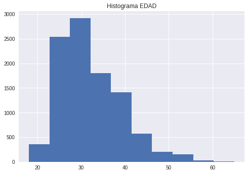
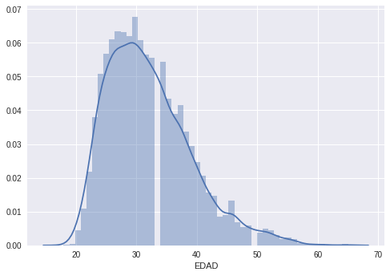
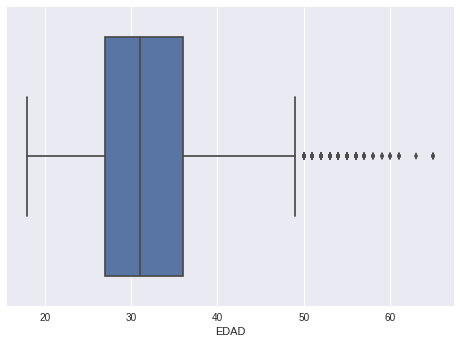

# Analisis Exploratorio Dataset DEMOGRAFICOS


```python
El análisis univariado es quizás la forma más simple de análisis estadístico. El hecho clave es que sólo interviene una variable.

<center>** Indice del Proyecto **</center>

* [Configuración y Carga de Datos](#setup)
* [Preprocesamiento de Datos](#preprocessing)
* [Análisis estadístico y visualización](#general)

## Configuración y Carga del DataSet <a id="setup" /> 
```


```python
%pylab inline
```

    Populating the interactive namespace from numpy and matplotlib


```python
import dataiku                               # Acceso al Dataset para Dataiku
import pandas as pd, numpy as np             # Manipulación de Datos
from matplotlib import pyplot as plt         # Graficos 
import seaborn as sns                        # Graficos
#sns.set(style="white")                       # Tuning the style of charts
import warnings                              # Desahabilitar algunos warnings
warnings.filterwarnings("ignore",category=DeprecationWarning)
from scipy import stats                      # Estadisticas
```

Lo primero que hacemos ahora es cargar el conjunto de datos y poner a un lado los tres tipos principales de columnas:

* Numericos
* Categórico
* Fechas

El análisis estadístico requiere tener los datos en memoria, sólo vamos a cargar una muestra de los datos. En caso de ser necesario se puede modificar la siguiente linea para aumentar el tamaño de los datos.


```python
dataset_limit = 10000
```

Carga del Dataset de Acuerdo al parametro anterior


```python
mydataset = dataiku.Dataset("DEMOGRAFICOS")
df = mydataset.get_dataframe(limit = dataset_limit)
df_orig = df.copy()

# Obtener los datos de las columnas
numericas_columns = list(df.select_dtypes(include=[np.number]).columns)
categoricas_columns = list(df.select_dtypes(include=[object]).columns)
fecha_columns = list(df.select_dtypes(include=['<M8[ns]']).columns)

# Imprime un breve resumen de lo que acabamos de cargar
print "DataSet Cargado"
print "   Registros: %s" % df.shape[0]
print "   Columnas: %s (%s numericas, %s categoricas, %s de Fecha)" % (df.shape[1], 
                                                    len(numericas_columns), len(categoricas_columns),
                                                    len(fecha_columns))
```

    DataSet Cargado
       Registros: 10000
       Columnas: 21 (7 numericas, 14 categoricas, 0 de Fecha)
    Lista Variables Numericas


## Preprocesamiento de Datos <a id="preprocessing" />


```python
value_col = 'EDAD'
print "Columna Seleccionada '%s'" % (value_col)
v = df[value_col].mean()
if np.isnan(v):
    v = 0
print "Columna '%s' con %s" % (value_col, v)
df[value_col] = df[value_col].fillna(v)
df_pop_1 = df[value_col]
```

    Columna Seleccionada 'EDAD'
    Columna 'EDAD' con 32.103


## Analisis Estadistico y Visualización <a id="general" /a>

### Estadísticas generales
Número de registros, media, desviación estándar, valor mínimo, cuartiles, valor máximo, modo, varianza, asimetría y kurtosis.


```python
additional_stats = ["var", "skew", "kurtosis"]
print "Estadistica sobre la serie:\n", df_pop_1.describe().append(pd.Series(NaN if df_pop_1.mode().empty else df_pop_1.mode()[0], index=["mode"])).append(pd.Series([df_pop_1.__getattr__(x)() for x in additional_stats], index=additional_stats))
```

    Estadistica sobre la serie:
    count       10000.000000
    mean           32.103000
    std             6.968045
    min            18.000000
    25%            27.000000
    50%            31.000000
    75%            36.000000
    max            65.000000
    mode           30.000000
    var            48.553646
    skew            0.876978
    kurtosis        0.777347
    dtype: float64


### Histograma
Los histogramas le permiten ver el número de ocurrencias en su columna de valores.


```python
plt.title("Histograma "+value_col);
plt.hist(df_pop_1);
```





### Distplot
Distplots combinan un histograma con una estimación de la densidad del núcleo.


```python
sns.distplot(df_pop_1);
```





### Boxplot
Una forma sencilla de representar los datos estadísticos en una gráfica en la que se dibuja un rectángulo para representar el segundo y tercer cuartil, con una línea vertical dentro para indicar el valor medio. Los cuartiles inferior y superior se muestran como líneas horizontales a cada lado del rectángulo.


```python
sns.boxplot(df_pop_1);
```





### Violin Plot
El diagrama de violín es similar a los diagramas de caja, excepto que también muestran la densidad de probabilidad de los datos en diferentes valores. Las gráficas de violín incluyen un marcador para la mediana de los datos y una caja indicando el rango intercuartil, como en las gráficas de caja estándar. Sobrepuesto en esta gráfica de caja hay una estimación de la densidad del núcleo.
